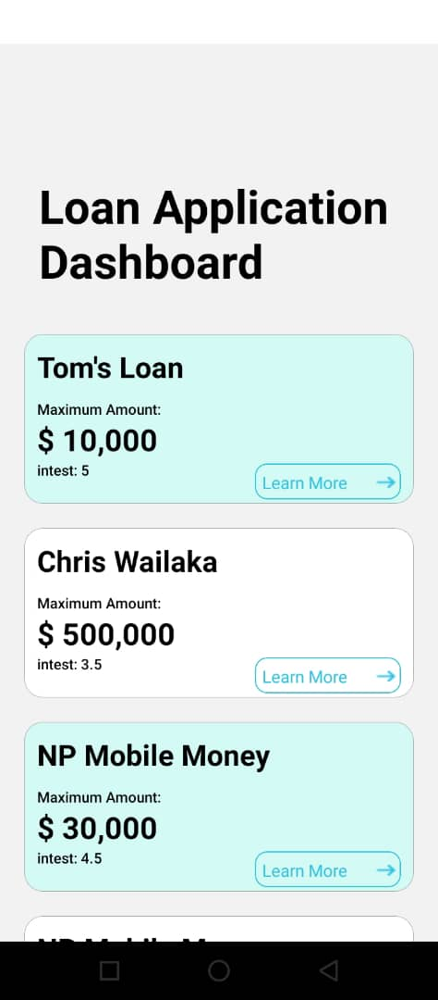
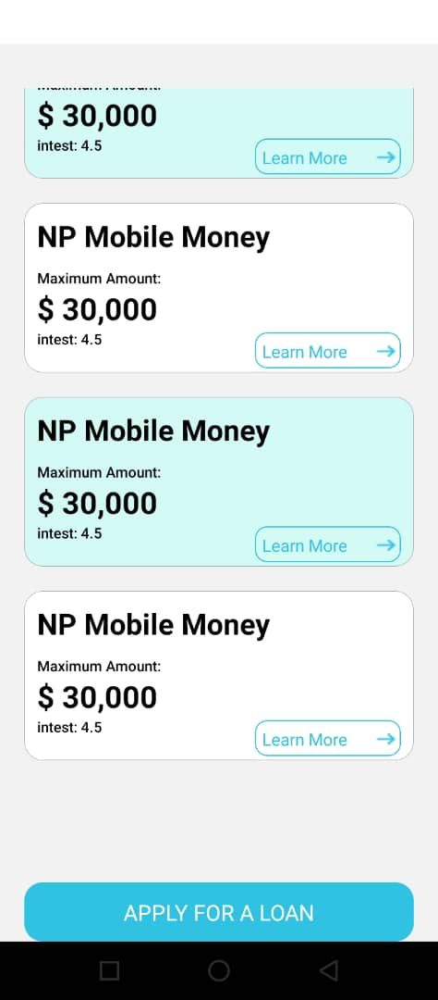
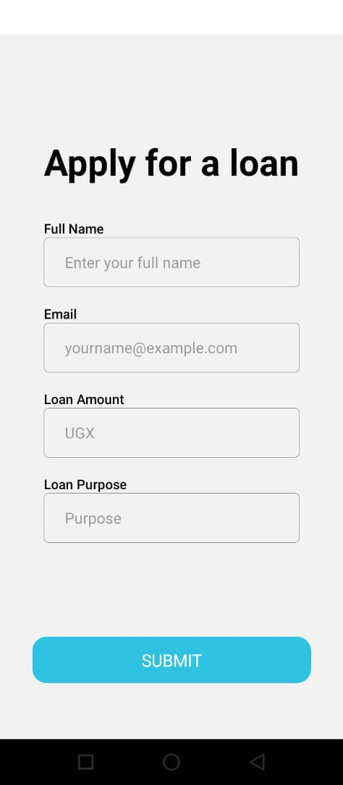
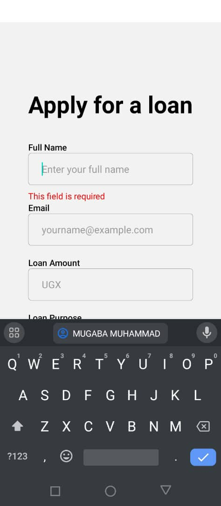
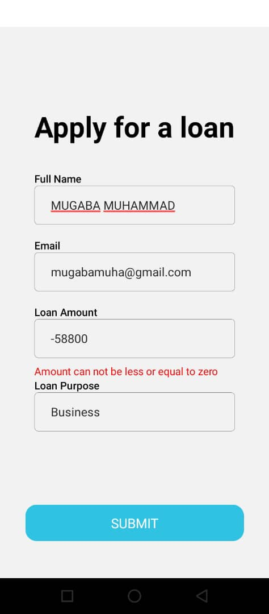
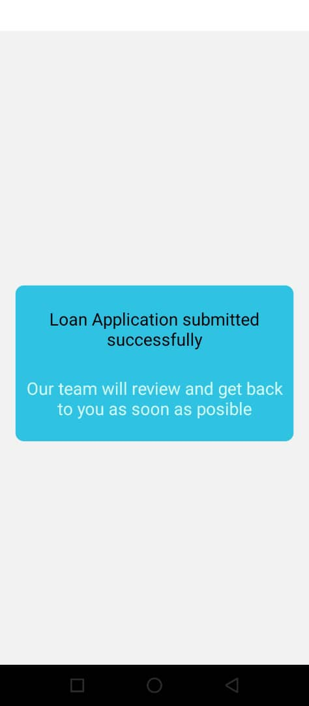

# APP SETUP INSTRUCTIONS

## Changes to match your machine.

1. Change directory to numida cd numida `cd numida/`

2. In the file env.json, change the ip to your machine ip so that the app bundler can connect to your server (check server README.md)

## Installation and running

# Requirements

## Please download the expo app

### There two ways you can run the UI/App

1. ##### Normally with expo

   1. cd into numida `cd numida/`
   2. run `nvm i` # this is to set node version the app uses
   3. Run `yarn instal`
   4. To start the project run `yarn start`
   5. To run tests run `yarn test`

2. #### run with docker
   1. cd into numida `cd numida/`
   2. Build the image using `docker build -t numida-app .` if you have permission issues with docker please run `sudo docker build -t numida-app .`
   3. Run the image by `docker run --network="host" -it numida-app` or `sudo docker run --network="host" -it numida-app`

# SERVER APP INSTRUCTION.

1. change into server component `cd server/`

## Run the server

1. Build the image, run this command `docker build -t app . ` or `sudo docker build -t app . `
2. Run the image, run this command `docker run -p 5000:5000 app` or `sudo docker run -p 5000:5000 app`

# Sample images from the app.

### Dashboard screen shots

### Loan Application screen Shots

## Note

I have provided a sample of screens.
I hope to discuss other parts of the application once we meet again.
